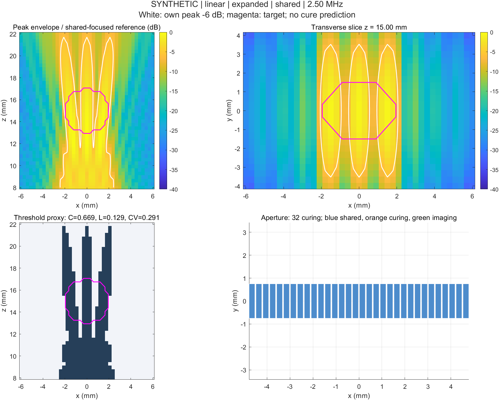
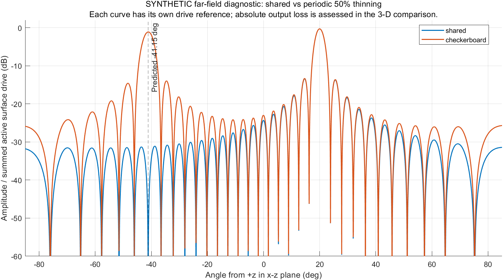

# ICE-Sonocuring 第一阶段工程实现与仿真结果报告

- **报告日期：**2026 年 9 月 23 日
- **项目位置：**`H:\print_transducer`
- **GitHub 仓库：**[Zh9426/ICE-Sonocuring](https://github.com/Zh9426/ICE-Sonocuring)（私有）
- **运行环境：**Windows、MATLAB R2024b Update 2（24.2.0.2773142）
- **阶段定位：**虚拟 ICE 阵列的声场筛选与软件验证

## 1. 项目目标与交付范围

项目研究 ICE（心腔内超声）阵列由成像扩展为成像与超声触发固化双功能探头时，可形成怎样的声场，以及共享阵元与空间分区两类架构会产生什么差别。本阶段针对低阈值声响应材料的封堵设想，建立可以更换几何、激励、阈值和求解器的 MATLAB 工程底座。

交付物包括：线阵与矩阵阵列几何、有限尺寸矩形阵元的单频声压求解器、三类发射模式、两类成像/固化架构、压力与等效强度阈值指标、参数扫描、远场栅瓣诊断、数值收敛检查、49 项测试、示例图表与可检查的外部接口。当前没有真实探头型号、换能器输出标定、材料阈值单位或实验水槽数据，因此所有默认数值明确标为 **synthetic（演示）**。计算的“超阈值覆盖”是模型筛选量，不是经过实验验证的固化率。

## 2. 代码组织与数据流

一次仿真的数据流为：

```text
配置（几何、介质、源、模式、目标、阈值）
    ↓
阵元中心/尺寸 → 成像与固化掩码 → 各 shot 的幅值和延时
    ↓
三维采样点上的复声压（每个 shot 单独保存）
    ↓
时序聚合（峰值包络、脉冲内/全时段等效强度）
    ↓
目标体素与阈值 → 覆盖率、目标外比例、均匀性、波束剖面
    ↓
PNG 图、CSV 表、MAT 原始结果、非执行的接口 JSON
```

核心函数位于 `simulation/+ice/`，以 `ice.` 命名空间调用。配置位于 `config/`，可执行入口位于 `scripts/`。`tests/` 放 MATLAB function-based tests。`adapters/+iceio/` 保留 k-Wave 和 Verasonics 的数据交接边界。`data/` 预留原始资料；`verasonics/` 各目录目前只有接口说明。完整参数含义及单位见 [参数字典](parameter_dictionary.md)，物理推导和模型边界见 [系统架构说明](system_architecture.md)。

### 2.1 主要实现模块

| 文件 | 输入与输出 | 实际作用 |
|---|---|---|
| `config/demo_config.m` | 阵列类型 → 完整配置 | 给出线阵或矩阵的**合成**演示数值；真实探头参数不从这里推断 |
| `config/real_ice_template.m` | 无 → 待填配置 | 保留探头、材料、硬件、介质等未知项；`validate_config` 会拒绝未确认配置 |
| `simulation/+ice/make_geometry.m` | 阵列类型、数量、间距、尺寸 → 阵元坐标/尺寸 | 构建 side-looking 平面线阵或矩阵阵列 |
| `simulation/+ice/partition_elements.m` | 阵列与架构 → imaging/curing 掩码 | 全阵元共享或中央、外围、棋盘、随机、自定义空间分区 |
| `simulation/+ice/make_sequence.m` | 几何、固化掩码、模式参数 → 每次发射的幅值、延时、停留权重 | 点聚焦、有限孔径宽波束、多个焦点顺序扫描；支持加窗、孔径和两种驱动归一化 |
| `simulation/+ice/make_grid.m` | x/y/z 均匀体素中心 / m → M×3 点列与体素体积 | 定义三维 ROI，禁止无厚度单层切片冒充体积 |
| `simulation/+ice/solve_pressure.m` | 几何、shot、三维点、声学常数 → M×K 复声压 / Pa | 对矩形阵元表面做 Rayleigh 积分中点求积；K 个 shot 分别计算 |
| `simulation/+ice/aggregate_exposure.m` | 每个 shot 声压、停留权重、占空比 → 三类空间暴露量 | 取单独 shot 的峰值包络、按停留时间平均的等效强度、再乘占空比的全时段等效强度 |
| `simulation/+ice/evaluate_threshold.m` | 暴露量、目标掩码、体积、阈值 → C、L、CV 等 | 压力或等效强度阈值筛选；绝对阈值要求声明标定 |
| `simulation/+ice/beam_metrics.m` | 空间切线与幅度 → −6 dB 宽度、次级峰状态 | 遇到视野边界截断或缺少主瓣两侧极小值时标记不可判定 |
| `simulation/+ice/angular_response.m` | 阵列、shot、角度 → 远场角响应 | 独立诊断规则稀疏孔径的角度峰，不能替代有限距离三维声场 |
| `simulation/+ice/simulate.m` | 完整配置与可选公共参考 → 全部结果结构 | 把几何、求解、聚合、阈值和切线指标组合起来 |
| `simulation/+ice/plot_result.m` | 仿真结果 → 四联图 PNG | 显示两个声压切面、阈值切面与阵元分配 |
| `simulation/+ice/summary_row.m` | 仿真结果 → CSV 一行 | 同时记录指标、源条件、驱动、参考、阈值和单位 |
| `simulation/+ice/validate_config.m` | 配置 → 校验或错误 | 检查 SI 正值、完整目标是否位于 ROI、真实参数是否确认 |
| `adapters/+iceio/export_handoff.m` | 几何、序列、配置 → JSON | 导出带单位的非执行数据契约；保留延时“秒”，不猜测硬件 TX.Delay 单位 |
| `adapters/+iceio/prepare_kwave_input.m` | 几何、序列、配置 → 待办要求结构 | 罗列栅格化、时间步、PML、源/传感器映射等；目前不会运行 k-Wave |

### 2.2 坐标、物理公式及其适用范围

阵元在局部 x-y 平面，x 沿线阵/导管轴向，y 为俯仰方向，正 z 是 side-looking 出射方向。观测点仅在 z>0。源输入是**峰值法向表面速度**，单位 m/s，不是发射电压。时间相量约定为 `real(p·exp(iωt))`。求解器计算

\[
p(\mathbf r)=\frac{i\rho ck}{2\pi}
\sum_n v_0w_n e^{-i\omega\tau_n}
\sum_q \Delta S_{nq}\frac{e^{-ikr_{nq}}}{r_{nq}},\quad k=\frac{2\pi f}{c}.
\]

这里 `ρ` 为 kg/m³、`c` 为 m/s、`f` 为 Hz、`ΔS` 为 m²、`τ` 为 s，输出为 Pa 的复数**峰值相量**。有限宽度/高度通过阵元表面小片直接进入积分，没有再乘一遍矩形阵元的 `sinc` 因子。模型采用均匀、线性、单频、无损介质和刚性平面挡板；未计入导管曲率、声透镜、组织/血液界面、吸收、非线性、气泡、热场及材料反应动力学。这些条件与真实心腔内环境有距离。公式与适用范围在 [系统架构说明](system_architecture.md) 中列出原始技术资料。

线阵有 x 向独立延时，但同一行的阵元不能独立操控 y 向相位；当结构和介质对称时，`+y` 与 `−y` 的声场也对称。矩阵有第二维延时自由度。不过两种默认演示几何的阵元数、发声面积和孔径不同，不能把两组演示指标相减后宣称“矩阵改善了多少”。

## 3. 发射模式、架构与驱动约束

**focused：**按每个活动阵元到目标焦点的距离设置非负延时，使到达焦点的相位一致。输出仍受有限孔径和有限尺寸阵元的影响，声压空间最大值未必正好在设定焦点。

**broad：**采用平面波方向延时；默认 0° 时未聚焦。它是有限孔径发射，不保证形成均匀“面固化”。

**expanded：**在默认 x=−1.5、0、+1.5 mm，z=15 mm 的三个点逐次聚焦；默认停留权重均等。每个焦点是不同时间的发射。程序对压力记录“曾达到的最大幅值”，对等效强度按停留权重平均。图中三个高声压区域合并显示不意味着它们同时存在，也不意味着局部停留足以触发反应。

**shared：**成像和固化掩码均覆盖全部阵元，对应日后在时间上切换功能。当前没有成像接收仿真或事件时序。

**partitioned：**成像和固化掩码互补，可选中央固化、外围固化、棋盘交错、给定种子的随机稀疏或自定义掩码。比较脚本把固化比例设为 50%。程序只计算固化阵元发射声场；没有验证空间分区能否在真实硬件同时成像和固化。

`fixed_element` 保留活动阵元的用户指定幅值；半数阵元被分出后，源驱动面积通常下降。`fixed_total` 保持 `Σ(面积×幅值²)` 与完整均匀孔径相同；半数同面积单元时，活动单元幅值增加到约 √2 倍。这个量是表面速度平方的驱动代理，**不是严格相等的辐射声功率，也不保证真实设备能达到该单元幅值**。两套约束的比较不能混成一个“架构优劣”排名。

## 4. 阈值指标与读图规则

默认演示阈值为全阵元共享、focused 案例在**整个采样 ROI** 的峰值声压的 50%。线阵的公共参考约为 21,079 Pa，对应阈值约 10,539 Pa；矩阵演示的公共参考约为 17,581 Pa，对应约 8,790 Pa。两个参考不同，且源速度 0.01 m/s 是未标定的演示假设，因此这些 Pa 数值不能作为设备输出预测。

体积指标为

\[
C=\frac{V(\text{目标内且超阈值})}{V(\text{目标})},\qquad
L=\frac{V(\text{采样 ROI 的目标外且超阈值})}{V(\text{采样 ROI 的目标外})}.
\]

`C` 衡量目标体素有多少比例达到当前筛选阈值；`L` 衡量**所选 ROI 内**的目标外体素有多少比例达到阈值。增大或缩小 ROI 会改变 `L` 的分母。`CV=目标内所选物理量的标准差/平均值`，越低表示空间分布越均匀；均值为零时不可定义。三者均依赖目标、阈值定义、时间平均口径和网格。`L=0` 只表示当前 ROI/阈值/离散采样下没有目标外体素越线，不代表设备安全；`C=0` 也不代表声压为零或永远不能固化。

图中的两张彩色切面用**公共参考**转换为 dB，因而不同候选可横向比较幅值。白线是**各案例自身峰值**的 −6 dB 轮廓，只用于显示声束形状；紫线为目标边界。阈值黑白图单独显示达标体素。白线与材料阈值不能等同。−6 dB 宽度来自给定切线上的局部峰及插值；视野截断或主瓣两侧极小值不足时旁瓣字段为 `NaN`/状态说明，不能解释成“没有旁瓣”。远场角响应中的次级峰需要规则阵列的相位重复关系才可称为栅瓣。

阈值也可切换为强度：脉冲内或全时段的平面行波**等效强度**，单位 W/m²。实现使用峰值声压相量的 `|p|²/(2ρc)`，再按扫描停留权重及占空比平均。在近场/干涉场，准确的有功声强还需要粒子速度；该数值不能直接当作已测声能流。绝对压力或强度阈值要求标定来源说明；真实材料记录中“400”的单位和测量定义尚未确认，代码没有猜测或代入它。

## 5. 脚本说明与运行方式

在 MATLAB 中将工作目录切到仓库根目录，然后执行：

```matlab
startup_ice
run_tests
run_demo
compare_architectures(demo_config('linear'))
compare_architectures(demo_config('matrix'))
run_parameter_sweep
run_grating_demo
run_convergence
```

| 脚本 | 作用、主要输出和应如何使用 |
|---|---|
| `startup_ice.m` | 将项目的 `simulation/`、`config/`、`scripts/`、`adapters/` 加入当前 MATLAB 路径，不永久修改用户路径。其他脚本会自动调用它。 |
| `scripts/run_tests.m` | 运行 `tests/` 全部测试，导出 `results/validation/test_results.csv`；如有失败即报错。修改公式或配置接口后先运行。 |
| `scripts/run_demo.m` | 线阵/矩阵 × focused/broad/expanded，共六组；输出四联 PNG、完整 MAT、接口 JSON 和 `results/demo/summary.csv`。是理解单次结果和读图的入口。 |
| `scripts/compare_architectures.m` | 对某一固定阵列运行 shared、中央/外围、棋盘和随机分区 × 三模式，共15行；保持公共阈值参考。输出 `comparison.csv`、图和配置 MAT。传入不同 `cfg.excitation.normalization` 可比较两类驱动约束。 |
| `scripts/run_parameter_sweep.m` | 修改一个配置字段并复用原配置的阈值参考；默认扫描 1.5–3.5 MHz 共五点，输出 CSV 和配置 MAT。改变频率时没有自动模拟真实探头频响。 |
| `scripts/run_grating_demo.m` | 对转向20° 的虚拟线阵做远场角度扫描，比较完整和交替保留阵元；输出角响应 CSV、图及预测/观察方向。适合解释规则稀疏导致的相位重复。 |
| `scripts/run_convergence.m` | 比较表面积分小片加密与三维体素中心加密；输出误差、C/L 的变化及配置 MAT。拟用于正式参数扫描前的数值敏感性检查。 |

单次修改配置的例子：

```matlab
cfg = demo_config('linear');
cfg.architecture.type = 'partitioned';
cfg.architecture.pattern = 'checkerboard';
cfg.excitation.mode = 'expanded';
cfg.threshold.type = 'intensity';
cfg.threshold.intensity_basis = 'temporal_average';
cfg.threshold.scale = 'relative';
cfg.threshold.value = 0.25;
r = ice.simulate(cfg);
fig = ice.plot_result(r, 'results/custom_case.png');
close(fig)
disp(r.metrics)
```

较大的 MAT 保存完整压力数组、配置和中间量，适合复查；CSV 适合筛选和制表；PNG 便于目视检查；handoff JSON 只保存接口数据，不可直接作为硬件脚本。默认脚本重复运行会更新同名结果，因此真正实验应为每轮配置指定单独输出目录或把结果归档。

## 6. 已运行的示例及其含义

以下百分比来自 [六组演示数据](../results/demo/summary.csv)。所有数值都是未经标定的合成案例，当前默认阈值为相对声压 50%，不是某种材料的已知固化阈值。

| 几何与模式 | 活动阵元 | C：目标覆盖率 | L：目标外比例 | 目标内 CV | 读数说明 |
|---|---:|---:|---:|---:|---|
| 线阵 focused | 32 | 34.0% | 4.48% | 0.684 | 单点聚焦仅覆盖目标的一部分 |
| 线阵 broad | 32 | 0.0% | 0.00% | 0.117 | 本阈值下没有体素越线，但仍有非零声场 |
| 线阵 expanded | 32 | 66.9% | 12.91% | 0.291 | 扫描峰值包络扩大覆盖，也扩大目标外越线区域 |
| 矩阵 focused | 96 | 29.4% | 1.31% | 0.222 | 与线阵的物理资源不同，不能据此直接做维度因果比较 |
| 矩阵 broad | 96 | 15.3% | 1.11% | 0.203 | 当前宽波束条件下有部分体素越线 |
| 矩阵 expanded | 96 | 59.5% | 3.69% | 0.093 | 当前目标与阈值下较均匀，但只是计算场统计 |

例如 [线阵 expanded 四联图](../results/demo/linear_expanded.png) 中，彩色区域分布在三个 x 向焦点附近，白色 −6 dB 轮廓是各时刻峰值的合并包络。下方阈值图表明目标内和目标外都有超阈值点。`C=66.9%` **不能**读成“材料已有 66.9% 固化”，因为缺少每点所需曝光时间、压力/强度阈值定义和材料反应验证。



### 6.1 固化/成像阵元分区比较

四份逐案例原始表分别是 [线阵 fixed_element](../results/architectures_linear/comparison.csv)、[线阵 fixed_total](../results/architectures_linear_fixed_total/comparison.csv)、[矩阵 fixed_element](../results/architectures_matrix/comparison.csv) 和 [矩阵 fixed_total](../results/architectures_matrix_fixed_total/comparison.csv)。每份表含 5 个孔径配置 × 3 模式，共 15 行，并记录活动面积、最大幅值、源驱动代理、目标内 CV、主瓣切线宽度与次级峰判定状态。

为便于看清驱动约束的影响，下表仅列 **focused 模式**的 C/L：

| 架构（固化阵元数） | 线阵 fixed_element | 线阵 fixed_total | 矩阵 fixed_element | 矩阵 fixed_total |
|---|---:|---:|---:|---:|
| shared（32/96） | 34.0% / 4.5% | 34.0% / 4.5% | 29.4% / 1.3% | 29.4% / 1.3% |
| 中央固化（16/48） | 2.5% / 0.9% | 55.2% / 3.3% | 0.0% / 0.0% | 0.0% / 0.8% |
| 外围固化（16/48） | 0.1% / 0.1% | 22.0% / 1.9% | 0.0% / 0.0% | 0.0% / 0.3% |
| 棋盘交错（16/48） | 0.0% / 0.0% | 32.9% / 0.9% | 0.0% / 0.0% | 0.0% / 0.3% |
| 随机稀疏（16/48） | 0.0% / 0.0% | 32.2% / 1.3% | 0.0% / 0.0% | 0.0% / 0.3% |

每格为“C / L”。线阵中央分区在 `fixed_total` 下 C 从 2.5% 升至 55.2%，伴随活动单元幅值从 1 升至约 1.414；这不是一个可以免费取得的架构增益，而是驱动约束改变后得出的计算结果。矩阵半孔径即使在 `fixed_total` 下 C 仍为零，但整块 ROI 的峰值可高于阈值，例如中央固化的峰值约 13,061 Pa，大于共同阈值约 8,790 Pa；越线点主要不在目标体素内。由此不能推断求解器没有输出，更不能推断真实材料不会反应。

在线阵 **expanded** 模式，`fixed_element` 的 shared、中央、外围、棋盘、随机 C 分别约 66.9%、3.3%、0.1%、0%、0%；`fixed_total` 分别约 66.9%、97.5%、50.1%、56.6%、56.6%，同时 L 分别约 12.9%、10.0%、5.2%、3.2%、4.1%。这些变化体现目标覆盖、目标外越线、活动阵元幅值之间存在联合取舍；当前体素精度尚不足以按小百分比差异做最终排名。

### 6.2 频率扫描

默认 [频率扫描 CSV](../results/sweep/sweep.csv) 固定线阵、表面速度假设、ROI 和 **2.5 MHz 的公共声压参考阈值约 10,539 Pa**，仅改变 `frequency_hz`：

| 频率 | C | L | 目标 CV | x 切线 −6 dB 宽度 |
|---:|---:|---:|---:|---:|
| 1.5 MHz | 27.3% | 1.97% | 0.482 | 1.949 mm |
| 2.0 MHz | 34.0% | 3.62% | 0.617 | 1.460 mm |
| 2.5 MHz | 34.0% | 4.48% | 0.684 | 1.170 mm |
| 3.0 MHz | 34.0% | 4.56% | 0.746 | 0.965 mm |
| 3.5 MHz | 34.0% | 4.33% | 0.807 | 0.835 mm |

频率升高时，这一配置的 x 向切线宽度变窄；但目标覆盖在多个频点显示相同离散数值，体现体素阈值计数较粗。更重要的是，实际探头的电声效率和允许工作频率通常随频率变化，当前扫描固定的是**假设表面速度**，不是“相同输入电压的真实设备频率响应”。y 切线宽度在部分频点为 `NaN`，表示切线范围不足，不能填成零。

### 6.3 规则稀疏的栅瓣诊断

[栅瓣图](../results/grating_demo/grating_lobes.png) 与 [方向数值表](../results/grating_demo/grating_summary.csv) 使用 2.5 MHz、声速 1500 m/s，故波长为 0.6 mm。完整线阵中心间距为 0.3 mm；交替保留阵元后有效间距为 0.6 mm。转向 20° 时，规则阵列的相位重复关系预测 −41.146° 处出现可见的另一方向，角扫描在约 −41.10° 检出峰值，约为该稀疏孔径活动表面驱动参考的 −1.10 dB。图上每条曲线按**各自**活动驱动归一化，适合说明角度形状；比较绝对输出仍须看三维声场表和驱动约束。这个诊断不自动适用于随机稀疏阵列或矩阵的斜向峰。



## 7. 验证结果、数值精度和当前限制

MATLAB R2024b 下运行 `run_tests`，**49/49 项通过**、0 失败、0 未完成；对全部 `.m` 文件运行 `checkcode(...,'-id')`，返回 0 条消息。测试覆盖复数解析极限、聚焦延时符号、叠加、零源、矩形积分细化、顺序 shot 不能相消、停留/占空比、矩阵俯仰控制、体积阈值、分区确定性、栅瓣方向和接口 JSON 等。测试列表在 [test_results.csv](../results/validation/test_results.csv)，更详细的数值验证在 [验证记录](verification.md)。

**表面积分**：在 27 个指定近/远、轴上/偏轴观察点，2×11、4×22、8×44 小片相对于最细计算的复声压 L2 相对误差为 0.3376%、0.0671%、参考值。这证明这组采样点的小片误差随加密减小，但不等于所有配置均已收敛。

**三维体素阈值**：固定物理 ROI、阈值参考和同一线阵聚焦配置，体素数从 46,125 增至 369,000 再到 2,952,000 时，C 为 **34.0%、43.5%、38.8%**；最末两级仍差约 **4.61 个百分点**。相应 L 为 4.48%、4.54%、4.54%。C 的差异说明目标与超阈值边界的体素计数尚不稳定。当前所有“方案差多少个百分点”的读数，只适合作为探索性线索；发表或设计定案前，必须针对关键候选进一步加密并设定事先声明的收敛容差。原始表为 [surface_convergence.csv](../results/validation/surface_convergence.csv) 和 [voxel_convergence.csv](../results/validation/voxel_convergence.csv)。

此外，模型没有真实 ICE 曲率和声透镜、成像性能、组织/血液传播、吸收或温升计算。`Tmax` 尚无定义，所以没有把它默认为零构造 `J=w₁C−w₂L−w₃Tmax`。k-Wave 接口目前只列数据契约与待定采样决策，Verasonics 接口没有可执行 SetUp 脚本或 TX.Delay 转换；拿到探头资料后才能补齐。

## 8. 结果文件与后续工作

Git 仓库保留可直接审阅的 MATLAB 代码、文档、CSV 和 PNG；体积较大的 MAT 不纳入版本管理。克隆后运行脚本即可重建 MAT 和更新图表。重点路径为：

| 路径 | 用途 |
|---|---|
| [`results/demo/`](../results/demo/) | 六个基础案例及可视化；`summary.csv` 汇总 |
| [`results/architectures_linear/`](../results/architectures_linear/) 与 [`results/architectures_matrix/`](../results/architectures_matrix/) | 固定单元幅值比较 |
| [`results/architectures_linear_fixed_total/`](../results/architectures_linear_fixed_total/) 与 [`results/architectures_matrix_fixed_total/`](../results/architectures_matrix_fixed_total/) | 面积加权平方驱动积分固定的比较 |
| [`results/sweep/`](../results/sweep/) | 五点频率扫描 |
| [`results/grating_demo/`](../results/grating_demo/) | 远场角度数据与栅瓣图 |
| [`results/validation/`](../results/validation/) | 49 项测试、分析器和收敛证据 |

下一阶段应先确定真实 ICE 型号、阵元位置/曲率、频带、连接映射和可用驱动，随后厘清材料“400”的单位、压力/强度统计方式、占空比与曝光时间，做水听器标定和材料剂量实验。再将实测参数放入 `real_ice_template` 的副本，按同一坐标与单位接入 k-Wave，比较解析与时域模型，并根据真实硬件文档设计 Verasonics 时序。当前报告提供的是能够继续迭代和审查的科研软件基线。
